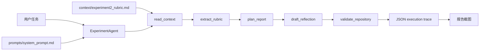

# 架构说明

本项目是一个小型离线 Agent 系统，核心由固定的 rubric context 和确定性的 tool registry 组成。

```mermaid
flowchart LR
    UserTask["用户任务"] --> Agent["ExperimentAgent"]
    Prompt["prompts/system_prompt.md"] --> Agent
    Context["context/experiment2_rubric.md"] --> ReadContext["read_context"]
    Agent --> ReadContext
    ReadContext --> Extract["extract_rubric"]
    Extract --> Plan["plan_report"]
    Plan --> Reflect["draft_reflection"]
    Reflect --> Validate["validate_repository"]
    Validate --> Trace["JSON execution trace"]
    Trace --> Screens["报告截图"]
```

这个设计的重点是：Agent 不把执行过程藏在外部服务里。每一步都表示成带有明确参数和结果的 tool call，因此可以在终端、JSON 文件和最终报告截图中检查完整执行过程。
