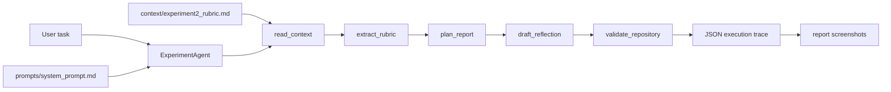

# Architecture

The project is a small offline agent system built around a fixed rubric context and a deterministic tool registry.

The important design point is that the Agent does not hide its reasoning in an external service. Each step is represented as a tool call with explicit arguments and results, so the execution can be inspected in the terminal, in JSON, and in the final report screenshots.
